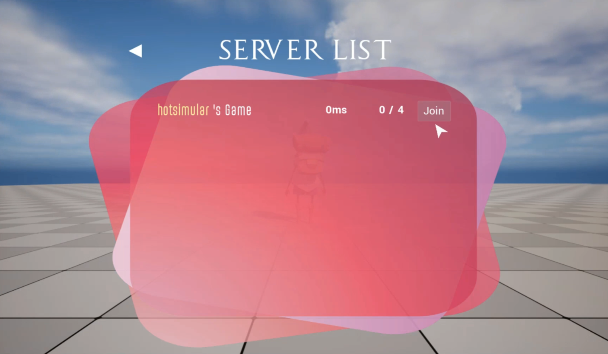

# Unreal Engine 5 Multiplayer Plugin

## WARNING: 
### The plugin is made for Unreal Engine 5.0, please check if you are using a different version.

## Introduction:
This is a C++-based plugin designed to create an attractive multiplayer menu while allowing seamless coop via Steam/Epic Games Platform.

Screenshots:

Main Menu

Settings

Server List

Successful Connected

## How To Use
Prerequisites: Install Online Subsystem Steam && Online Subsystem plugins
1. Put the plugin into the 'Plugin' directory of your own project
2. Go into the level blueprint of your startup level
3. Create a BeginPlay Event and connect it with create widget node
4. Select the Menu widget contained in the plugin and add to the Viewport
5. Enjoy!
## Features:
1. Button texts With Fade in/Fade out effect and color animation
2. Configurable video settings menu(Require self-implementation)
3. Standalone Steam/Epic Games Subsystem for session handling
4. Intelligent auto match making
5. Realtime game list display UI
6. Cartoon mouse cursor

## Video Showcase:
https://youtu.be/fYQb9UZMxq0
